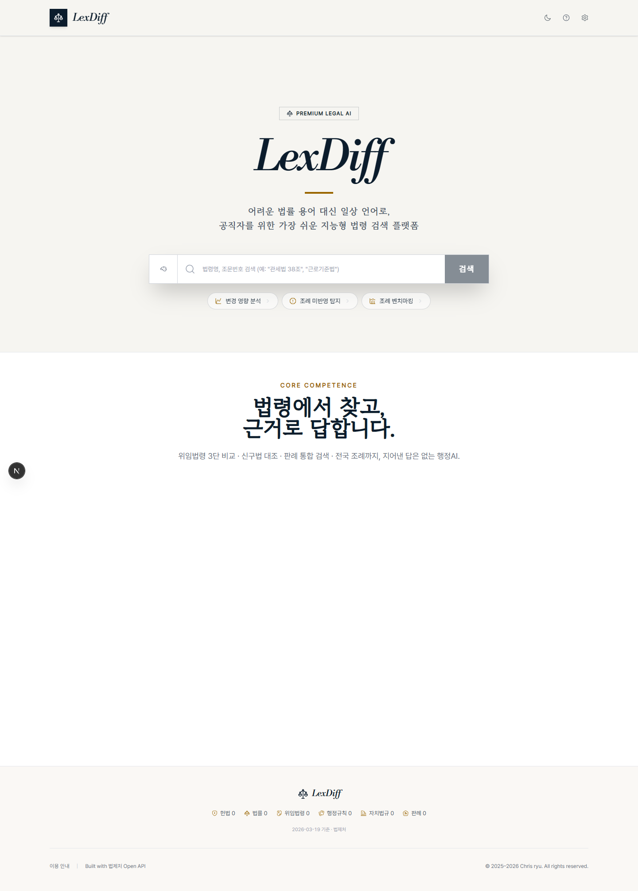
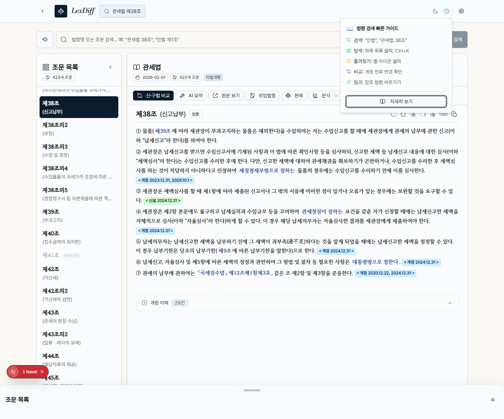
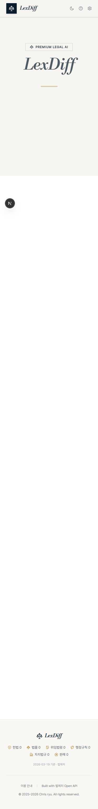
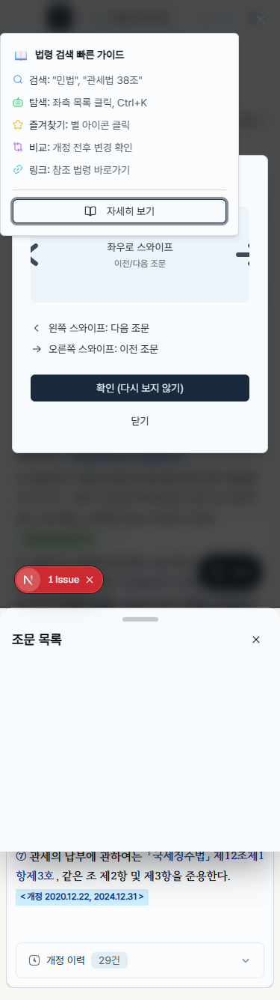

# UI/UX Audit — http://localhost:3000
**날짜**: 2026-03-20 23:29
**플로우**: 홈 → 법령 검색(`관세법 38조`) → 데스크톱 결과 → 모바일 홈/결과
**감사자**: Codex

---

## 인터랙션 플랜

1. 데스크톱 홈 랜딩 상태 확인
2. 데스크톱에서 실제 법령 검색 실행
3. 모바일 홈 반응형 확인
4. 모바일 결과 화면의 첫 방문 온보딩 상태 확인

---

## Step 1: 데스크톱 홈 랜딩

| 항목 | 내용 |
|------|------|
| **URL** | `http://localhost:3000/` |
| **액션** | 첫 로드 후 홈 랜딩 확인 |
| **발생한 일** | 브랜드형 히어로, 검색 입력창, 도구 CTA 3개, 하단 기능 카드 영역이 표시됨 |
| **기대 동작** | 검색 입력창이 즉시 보이고 첫 행동이 분명해야 함 |
| **심각도** | Low |

**코드 참조**: `components/search-view.tsx`, `components/search-bar-home.tsx`, `components/feature-cards.tsx`

**콘솔 에러**:
- `https://va.vercel-scripts.com/v1/script.debug.js`가 CSP에 막혀 로드 실패

**UX 문제**:
- 히어로 입력창과 CTA가 강한 애니메이션/지연 뒤에 나타나 첫 인상이 약간 늦다.
- 테마 토글과 설정 관련 아이콘 버튼은 시각적으로 작아 보이며 실제 터치 영역도 매우 작다.
- 홈 검색 입력은 placeholder만 있고 접근성 라벨이 없다.

**개선 제안**:
1. 검색 입력과 CTA는 첫 화면의 핵심 행동이므로 지연 없이 먼저 렌더링한다.
2. 헤더 아이콘 버튼은 최소 44x44 터치 타깃으로 확장한다.
3. 검색 입력에 `aria-label` 또는 실제 레이블을 부여한다.

---

## Step 2: 데스크톱 검색 결과

| 항목 | 내용 |
|------|------|
| **URL** | `http://localhost:3000/` |
| **액션** | `관세법 38조` 검색 |
| **발생한 일** | 법령 본문, 조문 목록, 액션 버튼, 상단 compact header가 정상 표시됨 |
| **기대 동작** | 본문에 바로 집중할 수 있고 보조 가이드는 방해하지 않아야 함 |
| **심각도** | High |

**코드 참조**: `components/search-result-view/index.tsx`, `components/floating-compact-header.tsx`, `components/usage-guide-popover.tsx`, `components/law-viewer.tsx`

**콘솔 에러**:
- `VersionError: The requested version (11) is less than the existing version (12).`
- `/api/article-history?lawId=001556&jo=003800` 요청이 `net::ERR_ABORTED`

**UX 문제**:
- 첫 진입 시 사용법 팝오버가 자동으로 열려 상단 작업 영역을 가린다.
- 검색은 성공하지만 IndexedDB 버전 불일치 에러가 콘솔에 반복되어 신뢰감을 떨어뜨린다.
- 액션 바의 주요 버튼 높이가 `28px` 수준이라 마우스와 터치 모두 빡빡하다.
- 결과 화면 입력도 접근성 라벨이 없다.

**개선 제안**:
1. 첫 방문 가이드는 자동 팝오버 대신 명시적 열기 또는 한 번만 보이는 비간섭형 배너로 바꾼다.
2. IndexedDB 버전 업그레이드 흐름을 한 곳에서 정리해 `VersionError`가 사용자 흐름 중 노출되지 않게 한다.
3. 결과 화면 액션 버튼과 헤더 아이콘 버튼을 최소 40~44px 기준으로 재설계한다.
4. 검색 입력은 홈/결과 화면 모두 공통 접근성 속성을 추가한다.

---

## Step 3: 모바일 홈

| 항목 | 내용 |
|------|------|
| **URL** | `http://localhost:3000/` |
| **액션** | 모바일 뷰포트 `375x812`에서 홈 확인 |
| **발생한 일** | 랜딩 구조는 유지되고 가로 스크롤은 발생하지 않음 |
| **기대 동작** | 모바일에서도 검색 입력과 CTA가 충분한 터치 영역을 가져야 함 |
| **심각도** | Medium |

**코드 참조**: `components/search-view.tsx`, `components/search-bar-home.tsx`, `components/theme-toggle.tsx`

**콘솔 에러**:
- 데스크톱과 동일하게 Vercel Analytics 스크립트가 CSP에 막힘

**UX 문제**:
- 홈 상단 아이콘 버튼은 모바일에서 특히 16x16, 32x32 수준으로 작다.
- 도구 CTA 칩도 높이가 `34px` 수준이라 권장 터치 크기보다 작다.
- 랜딩 타이포는 보기 좋지만 상단 인터랙션은 시각 계층 대비 터치 친화성이 낮다.

**개선 제안**:
1. 모바일 헤더 버튼과 CTA 칩은 높이 44px 기준으로 통일한다.
2. 모바일 전용 헤더에서 정보성 아이콘보다 검색/주요 행동 우선 순위를 더 높인다.

---

## Step 4: 모바일 검색 결과 첫 방문

| 항목 | 내용 |
|------|------|
| **URL** | `http://localhost:3000/` |
| **액션** | 모바일에서 `관세법 38조` 검색 |
| **발생한 일** | 본문은 로드되지만 사용법 팝오버, 스와이프 튜토리얼, 하단 조문 목록 패널이 동시에 겹침 |
| **기대 동작** | 첫 방문 온보딩은 한 번에 하나만 보이고 본문 읽기를 방해하지 않아야 함 |
| **심각도** | High |

**코드 참조**: `components/usage-guide-popover.tsx`, `components/swipe-tutorial.tsx`, `components/floating-compact-header.tsx`, `components/law-viewer/law-viewer-action-buttons.tsx`, `components/law-viewer/law-viewer-single-article.tsx`

**콘솔 에러**:
- 데스크톱과 동일하게 IndexedDB `VersionError`
- `/api/article-history` 요청 `net::ERR_ABORTED`

**UX 문제**:
- 자동 가이드 팝오버와 스와이프 튜토리얼이 동시에 열려 핵심 본문과 액션 바를 가린다.
- 액션 버튼 다수가 `28px` 높이로 모바일 탭에 불리하다.
- 결과 화면에는 가로 스크롤은 없지만 온보딩 오버레이 밀도가 너무 높다.
- 모바일 결과에서 무한 애니메이션 2개가 동작하며 `prefers-reduced-motion` 대응이 없다.

**개선 제안**:
1. 모바일 첫 방문에서는 한 번에 하나의 온보딩만 노출한다. 우선순위는 `스와이프 튜토리얼 > 사용법 팝오버` 또는 반대로 하나만 채택한다.
2. 모바일 액션 바 버튼을 44px 기준으로 재설계하고 텍스트/아이콘 혼합 밀도를 줄인다.
3. `prefers-reduced-motion` 환경에서는 자동 팝오버와 스와이프 애니메이션을 비활성화한다.

---

## 미적·구조 감사 결과

### 타이포그래피

| 항목 | 측정값 | 판정 |
|------|--------|------|
| 폰트 패밀리 | 홈 4종 감지 (`Pretendard`, `Libre Bodoni`, `RIDIBatang`, 내부 Geist) | ⚠️ |
| 본문 크기 | 홈 `16-20px`, 결과 `14-15px` | ✅ |
| 줄간격 | 홈 `26-32.5px`, 결과 `20-27px` | ✅ |
| 제목 위계 | 홈 `h1 96px / h3 48px`, 모바일 `h1 60px / h3 30px` | ✅ |

메모:
- 랜딩 타이포는 강하다.
- 실제 폰트 선언은 3종보다 많고 외부 CDN 의존이 크다.
- `Libre Bodoni`가 `font-display: block`이라 첫 페인트 지연 가능성이 있다.

### 색상 팔레트

| 항목 | 측정값 | 판정 |
|------|--------|------|
| 계산된 색상 수 | 홈 26종, 결과 28~30종 | ⚠️ |
| 최저 대비비 | 샘플링 기준 저대비 항목 미검출 | ✅ |
| WCAG AA 위반 요소 | 샘플링 기준 0개 | ✅ |

메모:
- 시각 인상은 네이비/골드 중심으로 일관적이다.
- 자동 집계는 투명도와 상태색을 포함해 과대계상될 수 있다.

### 여백·간격

| 항목 | 측정값 | 판정 |
|------|--------|------|
| 홈 4px 그리드 위반 | 0개 | ✅ |
| 결과 4px 그리드 위반 | `2, 6, 10, 14px` | ⚠️ |
| 사용 간격 값 종류 | 홈 13종, 결과 9~11종 | ⚠️ |

메모:
- 홈은 정제되어 있다.
- 결과 화면은 작은 보정값이 누적되어 밀도 일관성이 떨어진다.

### 레이아웃·구조

| 항목 | 측정값 | 판정 |
|------|--------|------|
| 최대 DOM 깊이 | 홈 13, 결과 21 | ⚠️ |
| 빈 div 수 | 홈 10, 결과 30 | ⚠️ |
| 단일자식 래퍼 | 홈 4, 결과 31~32 | ⚠️ |
| 레이아웃 방식 | flex 우세, grid 보조 사용 | ✅ |

메모:
- 홈은 비교적 단순하다.
- 결과 화면은 기능이 많아질수록 wrapper가 빠르게 늘어나고 있다.

### 치수 일관성

| 항목 | 측정값 | 판정 |
|------|--------|------|
| border-radius 종류 | 2~3종 + pill 값 | ✅ |
| box-shadow 패턴 | 홈 1종, 결과 4종 | ⚠️ |
| 버튼 높이 종류 | 홈 6종, 결과 7~8종 | ❌ |
| 아이콘 크기 종류 | 6종 이상 | ⚠️ |

메모:
- 결과 화면의 버튼 높이 분산이 가장 크다.
- `h-7` 기반 액션 버튼이 모바일/데스크톱 모두 너무 촘촘하다.

### 모바일·애니메이션

| 항목 | 결과 | 판정 |
|------|------|------|
| 가로 스크롤 | 없음 | ✅ |
| 무한 반복 애니메이션 | 모바일 결과 2개 | ⚠️ |
| 긴 트랜지션 | 홈 18개 | ⚠️ |
| `prefers-reduced-motion` | 미처리 | ❌ |

---

## 종합 요약

### 점수판

| 카테고리 | 점수 | 비고 |
|----------|------|------|
| 인터랙션 피드백 | 6/10 | 첫 방문 온보딩이 과도하게 겹친다 |
| 접근성 | 4/10 | 확대 금지, 작은 터치 타깃, 누락된 입력 라벨 |
| 에러 처리 | 5/10 | 검색은 성공하지만 캐시/분석 스크립트 에러가 누적된다 |
| 타이포그래피 | 7/10 | 브랜드 인상은 강하지만 폰트 운영은 분산돼 있다 |
| 색상·대비 | 8/10 | 시각적 대비는 안정적이다 |
| 여백·간격 | 6/10 | 홈은 좋고 결과 워크스페이스는 들쭉날쭉하다 |
| 레이아웃·구조 | 6/10 | 기능 확장으로 구조 밀도가 높아졌다 |
| 치수 일관성 | 5/10 | 버튼 높이와 타깃 크기 편차가 크다 |
| 반응형 | 7/10 | 가로 스크롤은 없지만 모바일 온보딩이 과밀하다 |
| 마이크로인터랙션 | 6/10 | 의도는 좋지만 자동 노출과 모션 절제가 부족하다 |

**총점: 60/100**

### 이슈 분류

| 레벨 | 건수 |
|------|------|
| Critical | 0 |
| High | 3 |
| Medium | 4 |
| Low | 3 |

### Top 5 이슈

1. **모바일 확대 금지** — 사용자가 확대할 수 없어 저시력/정밀 읽기 환경에 직접적인 제약이 생김 — `app/layout.tsx:9`
2. **첫 방문 온보딩 충돌** — 모바일 결과에서 사용법 팝오버와 스와이프 튜토리얼이 동시에 떠 본문과 액션을 가림 — `components/usage-guide-popover.tsx:33`, `components/swipe-tutorial.tsx:22`
3. **터치 타깃 과소** — 헤더/결과 액션 버튼 다수가 `28-36px` 수준이라 모바일 조작성이 낮음 — `components/theme-toggle.tsx:71`, `components/law-viewer/law-viewer-action-buttons.tsx:186`, `components/law-viewer/law-viewer-single-article.tsx:102`
4. **입력 접근성 라벨 누락** — 홈/결과 검색 입력이 placeholder에만 의존함 — `components/search-bar-home.tsx:90`, `components/search-bar/index.tsx:92`
5. **모션 절제 미흡** — 자동 팝오버, 무한 애니메이션, 테마 전환이 있으나 `prefers-reduced-motion` 처리가 없음 — `components/theme-toggle.tsx:24`, `app/styles/animations.css:15`

### Quick Wins (30분 이내)

- [ ] `app/layout.tsx`: `maximumScale`, `userScalable` 제한 제거
- [ ] `components/search-bar-home.tsx`, `components/search-bar/index.tsx`: `aria-label` 추가
- [ ] `components/swipe-tutorial.tsx`: 닫기 버튼에 `aria-label="닫기"` 추가
- [ ] `components/usage-guide-popover.tsx`: 모바일에서는 자동 오픈 비활성화
- [ ] `components/theme-toggle.tsx`: 최소 `w-11 h-11` 수준의 클릭 영역 확보

### 큰 개선사항 (디자인 결정 필요)

- [ ] 결과 화면용 액션 밀도 기준 재정의: `28px` 버튼 군을 40~44px 체계로 리팩터링
- [ ] 첫 방문 온보딩 정책 통합: 팝오버, 튜토리얼, 바텀시트의 우선순위와 중복 규칙 정의
- [ ] 폰트 운영 재정리: CDN 의존 축소, 실제 사용 폰트 2~3종으로 축소
- [ ] 결과 워크스페이스 디자인 토큰 정비: spacing, shadow, icon size, header density 통합

### 보조 데이터

- 기계 판독 결과: `ui-audit/2026-03-20-23-29.json`
- 스크린샷 폴더: `ui-audit/screenshots/`

---
*Generated from Playwright-based local audit on 2026-03-20 23:29*
